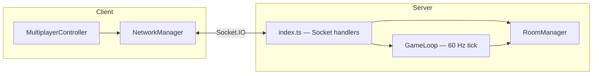
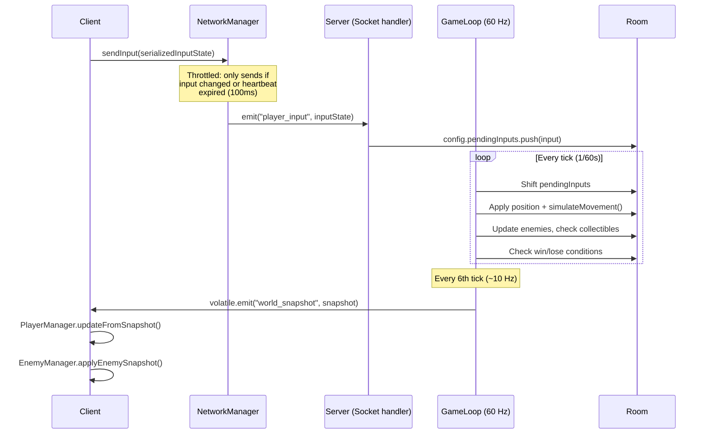

# Networking Architecture Summary

## Technology Stack

| Layer | Technology |
|---|---|
| Transport | **Socket.IO** over WebSockets |
| Server | **Node.js** with Express + `http.createServer` |
| Tick Engine | Custom fixed-step **60 Hz server game loop** |
| Shared Code | TypeScript types, constants, and payloads in [js/shared/](file:///Users/kristianekman/jetpack/js/shared) are imported by both client and server |

---

## Key Modules



| Module | File | Role |
|---|---|---|
| **NetworkManager** | [networkManager.ts](file:///Users/kristianekman/jetpack/js/network/networkManager.ts) | Client-side Socket.IO wrapper — connects, emits events, registers callbacks, measures ping/jitter, throttles input sends |
| **MultiplayerController** | [multiplayerController.ts](file:///Users/kristianekman/jetpack/js/network/multiplayerController.ts) | Binds network callbacks to game logic — lobby UI, match start, snapshot application, item/enemy sync, level complete/game over flows |
| **Server index** | [index.ts](file:///Users/kristianekman/jetpack/server/index.ts) | Express + Socket.IO server — handles all socket events, room CRUD, match lifecycle, relays tile/item/enemy events to rooms |
| **RoomManager** | [roomManager.ts](file:///Users/kristianekman/jetpack/server/roomManager.ts) | Manages `ServerRoom` instances — player join/leave, host migration, room serialization, tile map and enemy manager per room |
| **GameLoop** | [gameLoop.ts](file:///Users/kristianekman/jetpack/server/gameLoop.ts) | Fixed-timestep 60 Hz loop — processes player inputs, runs physics, updates enemies, checks win/lose conditions, broadcasts world snapshots |

---

## Network Event Catalog

All event names are defined in [constants.ts](file:///Users/kristianekman/jetpack/js/shared/constants.ts) under `ROOM_EVENTS` and `GAME_EVENTS`.

### Room Lifecycle Events

| Event | Direction | Purpose |
|---|---|---|
| `ping_handshake` / `pong_handshake` | Client ↔ Server | RTT measurement (every 2.5s) for adaptive interpolation delay |
| `create_room` → `room_created` | Client → Server → Client | Host creates a room with level, game mode, custom map, player profile |
| `join_room` → `room_joined` / `player_joined` | Client → Server → Room | Player joins by 4-char room code; broadcast to all room members |
| `leave_room` → `room_left` / `player_left` | Client → Server → Room | Player leaves; host auto-migrates to next player if host leaves |
| `list_rooms` → `room_list` | Client → Server → Client | Fetch public lobby rooms; server also pushes `room_list_updated` to watchers |

### Gameplay Events

| Event | Direction | Purpose |
|---|---|---|
| `player_input` | Client → Server | Serialized input state with sequence ID, position, velocity, and boolean flags |
| `world_snapshot` | Server → Room | Authoritative world state broadcast every 6 ticks (~10 Hz) via **volatile emit** |
| `start_match` → `game_started` | Host → Server → Room | Host starts match; server initializes tile map, enemies, spawn positions |
| `tile_phased` / `tile_restored` | Server → Room | Phase-brick destruction/regeneration relay (driven by server-side `TileMap` events) |
| `item_collected` | Server → Room | Emerald/fuel/gold/extra-life pickup — includes count and "all caught" flag |
| `enemy_destroyed` | Client → Server → Room | Client claims kill; server deduplicates via `destroyedEnemyIds` set, then broadcasts |
| `player_died` | Client → Server | Client reports death with reason; server decrements lives, starts 2s respawn timer |
| `complete_level` → `level_complete` | Client → Server → Room | Player reaches exit portal (server also detects this in game loop) |
| `next_level` → `game_started` | Host → Server → Room | Host advances to next campaign level; server reloads map and respawns |
| `game_over` | Server → Room | All players dead (co-op) or ≤1 player alive after 2.5s timer (compete) |

---

## Data Flow: Client Input → Server → Snapshot



---

## Snapshot Format

World snapshots use **compact tuple arrays** to minimize bandwidth:

### Player Snapshot Tuple (12 elements)
Defined in [PlayerSnapshotTuple](file:///Users/kristianekman/jetpack/js/shared/types.ts#L44-L57):
```
[socketId, playerId, x, y, vx, vy, fuel, lives, score, flags, animFrame, sequenceId]
```
- `flags` is a **bitmask** encoding: `facingRight | isGrounded | isThrusting | isClimbing | isPhasing | isDead`
- Coordinates are rounded to 2 decimal places to reduce payload size

### Enemy Snapshot Tuple (7 elements)
Defined in [EnemySnapshotTuple](file:///Users/kristianekman/jetpack/js/shared/types.ts#L59-L67):
```
[id, type, x, y, vx, vy, state]
```

---

## Network Tuning Parameters

Defined in [NETWORK_SETTINGS](file:///Users/kristianekman/jetpack/js/shared/constants.ts#L109-L115):

| Setting | Value | Purpose |
|---|---|---|
| `SNAPSHOT_INTERVAL_TICKS` | 6 | Broadcast every 6th tick → **~10 Hz** snapshot rate |
| `DEFAULT_INTERPOLATION_DELAY` | 100 ms | Render delay for remote entities to allow smooth interpolation |
| `MAX_EXTRAPOLATION_TIME` | 100 ms | Max time to extrapolate forward when packets are late |
| `SNAP_THRESHOLD_SQ` | 4096 (64²) | Hard-snap remote entities if error exceeds 64 px |
| `INPUT_HEARTBEAT_INTERVAL` | 100 ms | Send input even if unchanged (keepalive) |

### Adaptive Interpolation
The client runs a **ping monitor** every 2.5 seconds. It computes average RTT and jitter from the last 10 samples, then dynamically adjusts `interpolationDelay`:
```
interpolationDelay = clamp(80 + jitter × 2, 80, 180) ms
```

---

## Authority Model

> **Server-authoritative with client-side state forwarding.**

- The **client** runs its own physics locally and sends its current position/velocity along with input state (the `x`, `y`, `vx`, `vy` fields in `SerializedInputState`).
- The **server** accepts the client's reported position and then runs `simulateMovement()` to apply input-driven physics for the tick.
- The server is the **single source of truth** for: tile state, item collection, enemy destruction (deduplicated), death/lives, and win/lose conditions.
- Snapshots are emitted with **`volatile`** (Socket.IO unreliable delivery) since stale snapshots are worthless — the next one replaces them.

---

## Room Architecture

Each `ServerRoom` is a self-contained game instance with its own:

| Component | Purpose |
|---|---|
| `TileMap` | Server-side tile grid with event emitters for phase/restore/collect |
| `EnemyManager` | Server-side enemy simulation (flitzers, missiles, turrets, bosses) |
| `players` Map | `socketId → Player` entity instances for physics simulation |
| `playerConfigs` Map | `socketId → PlayerConfig` with input queues, sequence tracking, profile |
| `destroyedEnemyIds` Set | Deduplication for enemy kill claims |

Rooms support two game modes:
- **Co-op** (`coop`): All players collaborate; game over when all are dead; level complete when any player reaches the exit with all emeralds collected
- **Compete** (`compete`): Last player standing wins; 2.5s grace timer after ≤1 player remains

---

## Host Responsibilities

The room **host** (the player who created the room) has exclusive authority to:
1. **Start the match** (`start_match`)
2. **Advance to the next level** (`next_level`)
3. **Retry after game over**

If the host disconnects, the server automatically migrates host status to the next player in the room.
